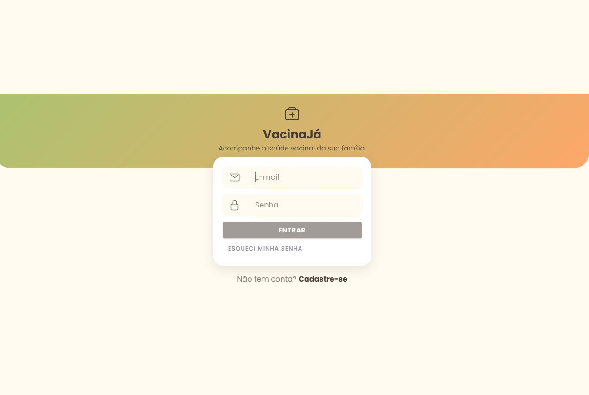
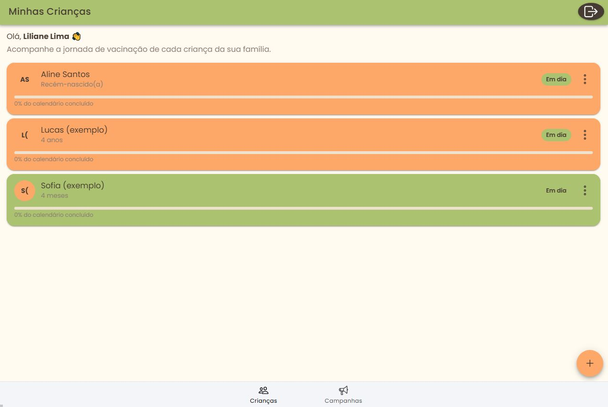
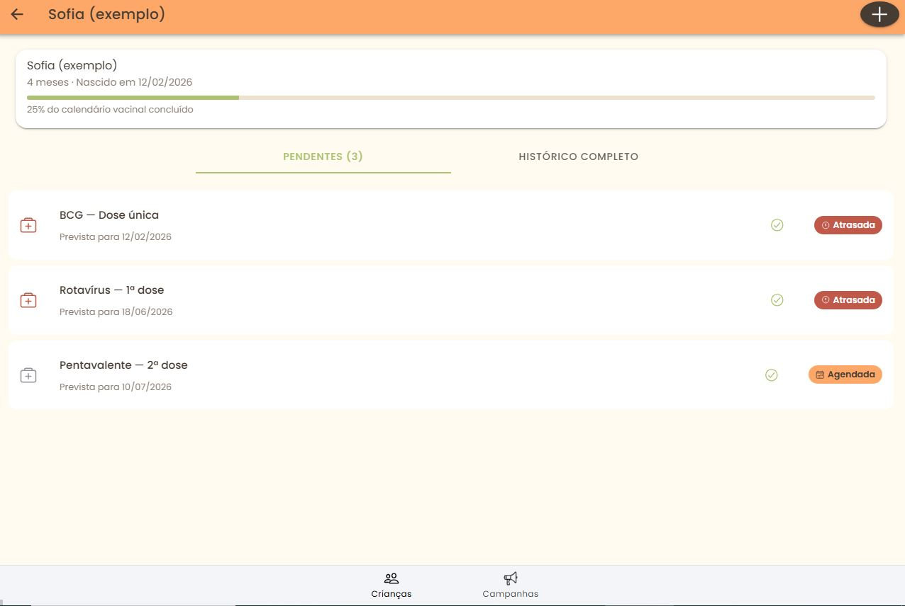
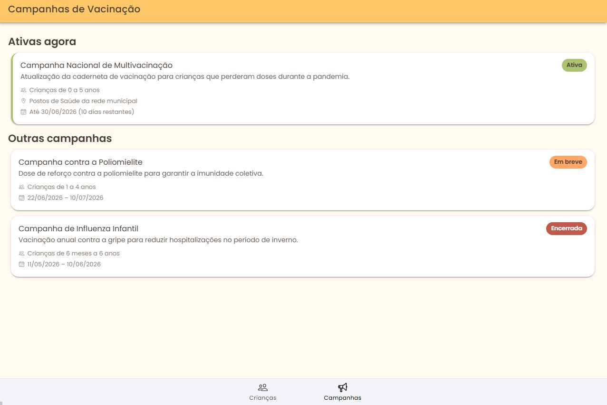

# VacinaJá 💉👶

> 🧪 **Para avaliar o projeto:** acesse o link publicado (ou rode localmente), clique em **"Cadastre-se"** e crie uma conta com qualquer e-mail e senha (não precisa ser um e-mail real nem confirmar o cadastro). Ao concluir, **duas crianças de exemplo já são criadas automaticamente** (Sofia e Lucas), com vacinas em diferentes situações — em dia, atrasada e próxima do vencimento — prontas para explorar todas as telas e funcionalidades sem precisar cadastrar nada manualmente. Não há necessidade de compartilhar nenhuma credencial: cada avaliador pode criar a própria conta.

Plataforma de acompanhamento da jornada de vacinação infantil, desenvolvida como solução para o desafio de estágio. Construída com **Ionic Framework + Angular** (standalone components).

## 📸 Demonstração

| Login | Minhas Crianças |
|---|---|
|  |  |

| Histórico vacinal | Campanhas |
|---|---|
|  |  |


## 🎯 Problema e proposta de solução

Pais e responsáveis hoje dependem da carteira física de vacinação, que é fácil de perder, rasgar ou esquecer em casa — e não avisa quando uma dose está atrasada. O **VacinaJá** resolve isso ao:

- Centralizar o calendário vacinal de **todas as crianças da família** em um só lugar, sem misturar históricos entre elas (Cenário 4).
- Calcular automaticamente o **status de cada dose** (Aplicada / Agendada / Próxima / Atrasada) a partir das datas previstas e aplicadas, deixando claro o que já foi feito e o que precisa de atenção (Cenários 1 e 2).
- Exibir **campanhas de vacinação ativas**, com público-alvo, local e prazo (Cenário 3).
- Mostrar um indicador visual de progresso (% do calendário concluído) por criança, facilitando a leitura rápida da situação vacinal.

## 🧱 Decisões de arquitetura

- **Standalone Components (Angular 17)**: cada página e componente é independente, sem NgModules, reduzindo boilerplate e favorecendo lazy loading nativo via `loadComponent`.
- **Modelagem orientada a objetos**: `Child`, `Vaccine`, `VaccineDose` e `Campaign` são classes com comportamento próprio (ex: `Child.getCompletionRate()`, `VaccineDose.getStatus()`), evitando lógica de negócio espalhada pelos componentes.
- **Separação de camadas**: `models/` (entidades), `services/` (acesso a dados e regras), `pages/` (telas), `shared/components/` (UI reutilizável: card de criança, badge de status).
- **Firestore + streams reativos**: `ChildService` expõe `children$`/`getDoses$()` como Observables ligados ao Firestore em tempo real — qualquer alteração (marcar dose, adicionar criança) reflete na tela automaticamente, sem recarregar a página.
- **Cálculo de status na entidade**: a regra "atrasada / próxima / em dia" vive no model (`VaccineDose.getStatus()`), não no componente, garantindo reuso e testabilidade.
- **Importação de componentes Ionic via `@ionic/angular/standalone`**: cada componente importa só o que usa (`IonButton`, `IonInput`, etc.) em vez do `IonicModule` clássico. Isso é necessário (não só estilístico) quando o bootstrap usa `provideIonicAngular()` — misturar as duas abordagens funciona em desenvolvimento, mas quebra silenciosamente no build de produção.

## 🎨 Design

Paleta obrigatória aplicada via variáveis Ionic em `src/theme/variables.scss`:

| Cor | Uso |
|---|---|
| `#ABC270` (verde) | Cor primária / status "em dia" |
| `#FEC868` (amarelo) | Cor terciária / status "atenção" |
| `#FDA769` (laranja) | Cor secundária / ações (FAB, destaques) |
| `#473C33` (marrom) | Texto e contraste |

Layout responsivo nativo do Ionic (grid e componentes adaptam-se a mobile, tablet e desktop automaticamente).

## 🔐 Autenticação e segurança (Firebase Auth)

Como a aplicação trata dados de saúde de crianças (dados sensíveis, LGPD), **login é obrigatório** antes de acessar qualquer tela. Foi implementado com **Firebase Authentication** (e-mail/senha):

- `src/app/services/auth.service.ts` — login, cadastro, logout, recuperação de senha e exigência de verificação de e-mail. Nenhuma senha é manipulada pela aplicação; tudo é delegado ao Firebase.
- `src/app/guards/auth.guard.ts` — bloqueia as rotas internas (`/children`, `/campaigns`) para quem não está logado.
- `src/app/pages/login` e `src/app/pages/register` — telas de entrada e cadastro.
- `firestore.rules` — **a camada de segurança que realmente importa**: garante no servidor que cada usuário só acessa os dados das crianças que ele mesmo cadastrou (`ownerId == request.auth.uid`), mesmo que alguém tente burlar o app e chamar a API diretamente.

### Como configurar seu próprio projeto Firebase

1. Crie um projeto em [console.firebase.google.com](https://console.firebase.google.com)
2. Ative **Authentication > Sign-in method > E-mail/senha**
3. Ative o **Firestore Database** (modo produção)
4. Em **Configurações do projeto > Seus apps**, crie um app Web e copie as credenciais para `src/environments/environment.ts` e `environment.prod.ts`
5. Publique as regras de segurança:
   ```bash
   firebase deploy --only firestore:rules
   ```

> **Atualização:** o `ChildService` já está conectado ao Firestore de verdade (sem mock). Ao logar, a lista de crianças vem vazia até você cadastrar a primeira pelo botão "+" na tela inicial — e cada criança/dose criada é salva isolada por `ownerId` no Firestore, validado também pelas regras de segurança (`firestore.rules`).
>
> Funcionalidades adicionadas:
> - **Adicionar criança**: botão "+" na tela inicial (nome + data de nascimento)
> - **Adicionar dose**: botão "+" no topo da tela de detalhe da criança (escolhe a vacina do catálogo, rótulo da dose e data prevista)
> - **Marcar dose como aplicada**: ícone de check ao lado de cada dose pendente
> - **Confirmação antes de marcar como aplicada**: evita toques acidentais — o app pede para confirmar a vacina e a data antes de gravar.
> - **Desfazer marcação**: tocando na badge "Aplicada", o responsável pode reverter uma marcação feita por engano, voltando a dose para pendente.
> - **Limite reconhecido**: como qualquer sistema autodeclarado (igual a carteira física), não há como o app *garantir* que a vacina foi realmente aplicada — isso depende da boa-fé do responsável. O que o app pode (e faz) é reduzir erros acidentais com confirmação explícita e permitir correção a qualquer momento.
> - **Editar/excluir criança e dose**: toque nos três pontinhos (⋮) no card da criança ou em qualquer dose para editar os dados ou excluir (com confirmação). Excluir uma criança remove também todas as doses associadas a ela.
> - **Duas crianças de exemplo são criadas automaticamente** ao concluir o cadastro (Sofia e Lucas), já com vacinas em situações diferentes — em dia, atrasada e próxima do vencimento — para que o responsável entenda como o app funciona antes de cadastrar os próprios filhos.

## 🚀 Deploy

🔗 Aplicação publicada: [https://vacina-app-murex.vercel.app/]

[https://vacina-app-2c83b.web.app]

O projeto pode ser publicado tanto na Vercel quanto no Firebase Hosting.

### Opção A — Vercel
O projeto já inclui `vercel.json`, configurado com:
- `buildCommand`: `npm run build`
- `outputDirectory`: `www` (saída do Angular, configurada em `angular.json`)
- `rewrites`: redireciona todas as rotas para `index.html`, necessário porque é uma SPA

**Passos:** suba o projeto pro GitHub e, na Vercel, "Add New" → "Project" → selecione o repositório → "Deploy" (o `vercel.json` é lido automaticamente).

### Opção B — Firebase Hosting
```bash
npm install -g firebase-tools
firebase login
firebase init hosting   # diretório público: www | configurar como SPA: Yes
npm run build
firebase deploy --only hosting
```

**⚠️ Importante após o primeiro deploy (em qualquer uma das opções):** o Firebase Authentication só aceita login de domínios autorizados.
1. Vá em [Firebase Console](https://console.firebase.google.com) → seu projeto → **Authentication** → aba **Settings** → **Authorized domains**
2. Clique em "Add domain" e cole o domínio publicado (sem `https://`, ex: `vacina-app.vercel.app` ou `seu-projeto.web.app`)

Sem esse passo, o login funciona no `localhost` mas falha (`auth/unauthorized-domain`) no site publicado.

## 📂 Estrutura do projeto

```
src/app/
├── models/            # Entidades: Child, Vaccine, Campaign
├── services/          # ChildService, VaccineService, CampaignService
├── pages/
│   ├── login/          # Autenticação
│   ├── register/       # Cadastro (já cria 2 crianças de exemplo)
│   ├── children-list/  # Tela inicial: lista de crianças
│   ├── child-detail/   # Detalhe + histórico vacinal de uma criança
│   └── campaigns/      # Campanhas ativas e futuras/encerradas
├── guards/
│   └── auth.guard.ts   # Bloqueia acesso sem login
├── shared/components/
│   ├── child-card/
│   └── vaccine-status-badge/
├── tabs.component.ts   # Navegação inferior (Crianças / Campanhas)
└── app.routes.ts
```

## ▶️ Como executar localmente

```bash
npm install
npm start
```
Acesse `http://localhost:4200`.

## 🔮 Próximos passos (não implementados)

- Notificações push para vacinas próximas do vencimento
- Upload de foto da carteirinha física (OCR para preencher doses automaticamente)
- Integração com sistemas oficiais de saúde (ex: e-SUS, RNDS) para confirmação oficial de aplicação de vacina

## 🛠️ Tecnologias

- Ionic Framework 7
- Angular 17 (standalone)
- TypeScript
- RxJS
